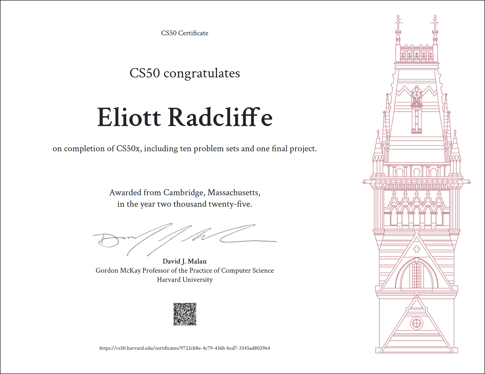
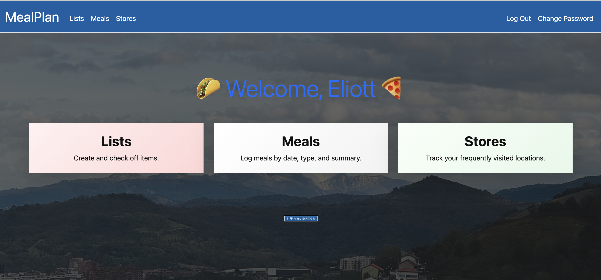
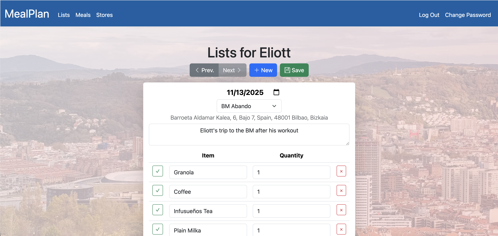

# CS50x
I created this repository for tracking homework assignments for Harvard CS50x, before realizing they were already being tracked in the [CS50 Codespace](https://github.com/code50/16735129).
It is now primarily for my development purposes on the final project, which is the subject of the rest of this Readme content.



# CS50X Final Project: MealPlan

| Main Page                                   | Lists Page                                    |
|---------------------------------------------|-----------------------------------------------|
|  |  |

#### Video Demo: [YouTube](https://youtu.be/XwLn9bsZ04s)

### [👩‍💻 Try it on Vercel](https://mealplan-three.vercel.app/)

## Description:

MealPlan is a simple web app that simplifies the creation of grocery lists and daily meal schedules.
It consists of three main pages:
 1. The lists page, splitting your shopping lists into trips by date, location, and description.
 2. The meals page, with the date, type (breakfast, lunch, dinner, or "hameikatako") and summary.
 3. The stores page, where you can enter the locations where you typically buy groceries.
Preceding these pages are account registration and logic screens, and a screen that allows you to change your password.

The project is implemented using Flask, with Bootstrap-styled HTML, client-side JavaScript, and database hosting by Supabase.
By logging in, an individual user will have their own unique set of shopping lists and meals, which will be persisted across sessions and devices.

Future features may include sharing of user data with friends and family members, and AI-generated meal plans based on your personal preferences.

## Vercel Hosting

MealPlan is hosted on Vercel at https://mealplan-three.vercel.app/.
To enable this hosting, I created a separate GitHub repository, outside of the CS50-provided codespace, at https://github.com/radcli14/cs50x, then, when creating the project on Vercel you may link to your GitHub account and your new repository.

For CS50 users that may use the Vercel hosting option, I highly recommend that, instead of starting your own Flask app from scratch following the procedure from lecture, download [one of the templates that Vercel provides](https://vercel.com/docs/frameworks/backend/flask) and start from there.
In my case, I had built a starter app that I could run via the `http-server` command, as we saw in lecture, however, as soon as I attempted to deploy on Vercel, the app would crash.
There are certain configuration details that are required for Vercel to work, and it is challenging to try to diagnose these if you are starting from a more complicated app, it is much better to start from the most basic template.

Once you have a functioning flask app that is configured for Vercel, you can test it locally using the command:
```sh
vercel dev
```
This will build and launch your app in the exact same way as if it were deployed on the Vercel cloud host, but allows you to test on your own system similar to the `http-server` command that we learned in the course.

## Supabase Data Persistence

User data, including lists, meals, and stores, are hosted on [Supabase](https://supabase.com/).
This is an open-source, Postgres hosting service, providing a similar set of CRUD commands to what we learned in the SQL section of CS50x.
If you begin a final project by creating a `.db` file, you will soon find that that database file 
- a) should not be tracked in your git repository (except as a simple template or example) because it contains user data and may become very large, and 
- b) will not be able to persist data across user sessions unless it is hosted externally to your app repository.
Supabase addresses both of these issues.

A fair amount of the setup of Supabase is in its web application, not actually in raw SQL code.
If you plan to use Supabase, I recommend using good SQL practices as a guideline for how you would structure your schema, but I would bypass creating a `.db` file, as the web application is going to be most convenient, and you likely won't be able to reuse the `.db` file anyway.
I had success by using Google Sheets to create example tables, exporting these as `.csv`, then importing them in the Supabase web application.
Subsequently, you will likely need to do some data manipulation, such as specifying which fields are integer, numeric, text, or other types, which are primary keys, are they unique, should they autoincrement, are they linked to other tables, etc.

Additionally, you must use the web application to find the URL and key for your hosted application.
You will then need to use *Vercel's* web application to store these keys in its hosting environment.
If you have done this correctly, then you can assess the keys in *your* Flask code.
```python
url: str = os.environ.get("MEALPLAN_SUPABASE_URL") or "unknown-url"
key: str = os.environ.get("MEALPLAN_SUPABASE_KEY") or "unknown-key"
```

Supabase provides its own Python module, which, while differing in syntax from the SQL module we learned in lecture, is very similar in logic.
For example, in MealPlan there is a `Lists` table.
To access this entire table, you could use the Python script:
```python
from supabase import create_client, Client
supabase: Client = create_client(url, key)  # must provide your own url and key
response = supabase.table("Lists").select("*").execute()
lists = response.data
```
This is roughly equivalent to the SQL command
```sql
SELECT * FROM Lists;
```
While we can see there is more code in the Python version, note the following:
- The module import and client creation only need to be done once, at the top of your file.
- The response contains not just the query result in the `.data` field, but also diagnostics if the query fails.
- The query is constructed using class methods, separating query logic into distinct steps, and providing more security than raw SQL.

Other methods I have made use of in MealPlan include the equate, or `.eq` method, which I use below for only querying user data that match user's ID of 1, which is my own account.
```python
response = supabase.table("Users").select("*").eq("id", 1).execute()
```
Also, the `.from_` method may be used to join multiple tables, provided that foreign key relationships have been properly configured.
I tend to prefer a "flattened" dictionary structure in Python, hence the post-querying code in the example below.
```python
response = supabase.from_("Trips").select("id, user_id, store_id, date, summary, Stores(name, address)").execute()
trips = response.data
for trip in trips:
    for store_key in trip["Stores"].keys():
        trip[store_key] = trip["Stores"][store_key]
    trip.pop("Stores");
```

## Key Files

In the top-level directory, we find the `main.py` file which provides our Flask app routes, and the `database.py` file which implements logic for communicating with Supabase.
The `helpers.py` file is largely reused from lecture, with the same meme-ified `apology` page, and `login_required` deocrator.
Python module requirements and Vercel configuration are contaned in `requirements.txt` and `vercel.json`, respectively, though I rarely touched these after downloading the template.

The `templates` folder contains HTML files, generally extending the `layouts.html` base file, which largely matches the one used in the Finance assignment.
Naming conventions of these files matches the naming of the pages that you visit in the browser.

The `static` folder contains image files and Javascript, the latter of which is used on the client side, with naming convention to match the associated HTML.
These Javascript files are called using `<script>` tags in the body of the corresponding HTML.

## AI Use

In the course of developing this web app, I did use the following AI tools:
- Gemini in the browser, for answering how-to questions about Flask, HTML, or Javascript.
- GitHub Copilot inside of a CodeSpace, for application-specific questions, autocomplete, and some code generation.
Top-level app design, basic architecture and code templating, Vercel/Supabase setup, and other tasks were performed by myself, the human.
